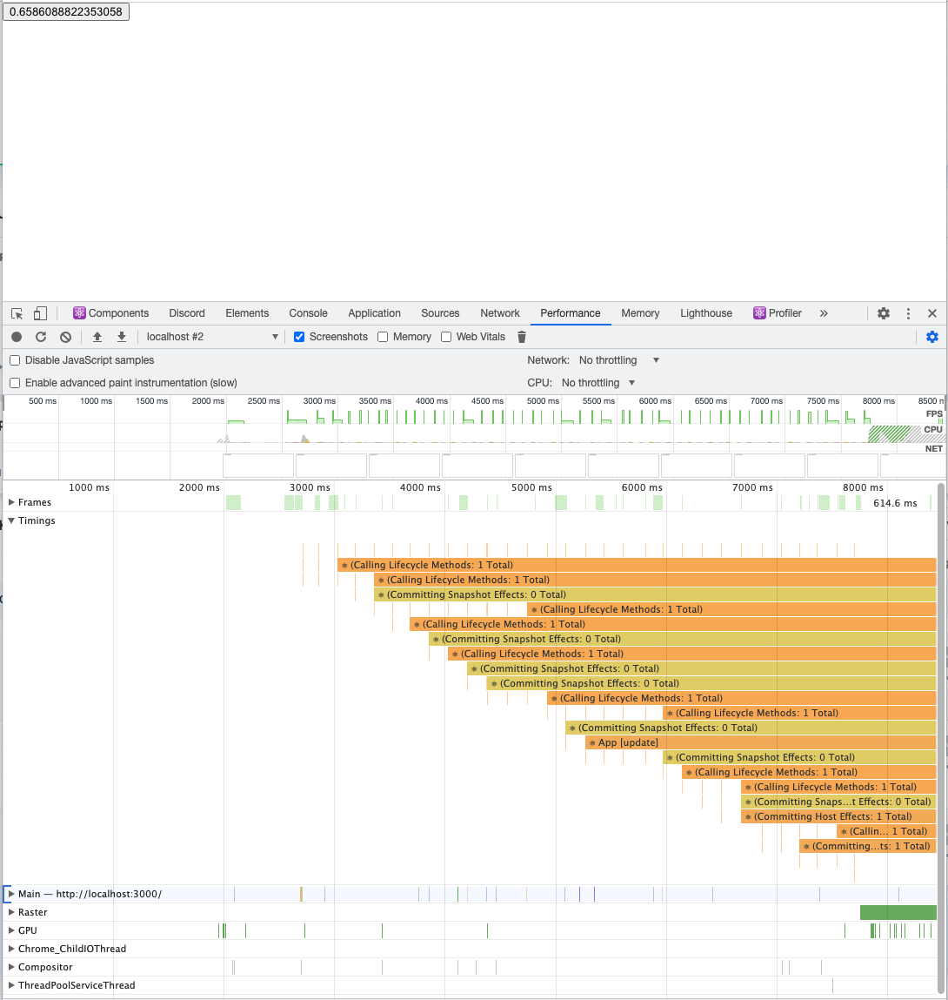

# User Timings Bug Repro for Chrome Version 91.0.4472.77 (Official Build) (x86_64)

## Steps to Reproduce

1. Clone this repo
2. `yarn`
3. `yarn start`
4. open `localhost:3000`
5. open Chrome DevTools and start profiling
6. Start clicking the button really fast a bunch of times. Maybe for 5-10 seconds.
7. Stop the profiler quickly after the last button press.
8. Check the Timings tab

**It doesn't happen consistently so you may have to do steps 5-8 a few times to reproduce the issue**

## Results

You can see the `Calling Lifecycle Methods` timing block spans almost the entire width of the profile and is some absurd duration like `5.4s`. You will likely see more accurate timing blocks interspersed that have more accurate timings (`<1ms`)

